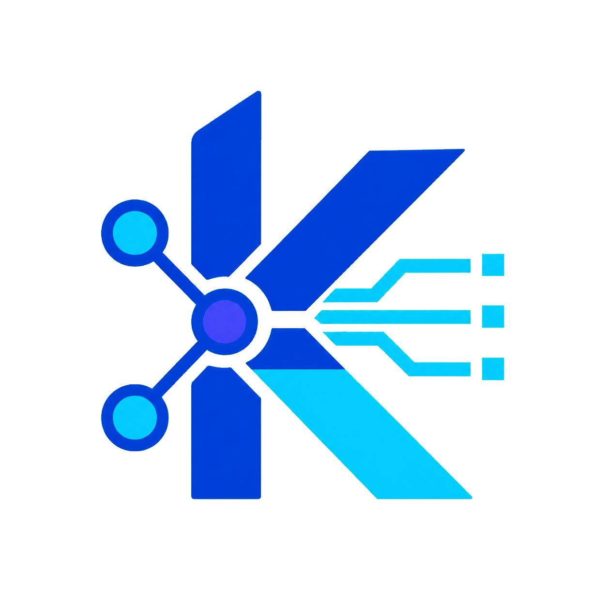

<p align="center">
  
</p>

# kube-accelerator-sim

> **Simulate Capacity. Validate Scheduling.**

`kube-accelerator-sim` (`kasim`) projects source-backed accelerator resource
contracts into an explicitly selected, already-existing Kubernetes cluster.
It is intended for platform scheduling, inventory, admission, and integration
tests when physical accelerators are unavailable.

Read the online documentation in
[English](https://linkmaq.github.io/kube-accelerator-sim/) or
[简体中文](https://linkmaq.github.io/kube-accelerator-sim/zh/), or continue
with the repository quick start below.

The product supports bounded Kubernetes versions 1.30–1.36. Scalar
extended-resource scheduling is supported across that range; stable
`resource.k8s.io/v1` DRA control-plane projection is supported on 1.34–1.36.
The CLI does not manage cluster lifecycle. Test-only workflows may create
disposable clusters, but that behavior is not a product command.

## Quick start

Build the CLI and inspect the bundled, evidence-backed catalog without
contacting a cluster:

```sh
go build -trimpath -o ./dist/kasim ./cmd/kasim
./dist/kasim profile list -o json
./dist/kasim apply -f ./examples/single-node-single-accelerator.yaml \
  --dry-run=client \
  -o json
```

Install the shared runtime separately into an existing cluster, always naming
both the kubeconfig and context:

```sh
kubectl --kubeconfig ./target.kubeconfig --context target \
  create namespace kasim-system

helm upgrade --install kasim-runtime ./charts/kasim-runtime \
  --kubeconfig ./target.kubeconfig \
  --kube-context target \
  --namespace kasim-system \
  --wait
```

Then submit and observe a scenario:

```sh
./dist/kasim apply -f ./examples/single-node-single-accelerator.yaml \
  --kubeconfig ./target.kubeconfig \
  --context target \
  -o json

./dist/kasim status single-node-single-accelerator \
  --kubeconfig ./target.kubeconfig \
  --context target \
  -o json
```

Open the embedded, read-only inventory with the kubeconfig and current context
that kubectl would use:

```sh
./dist/kasim ui --open
```

Use `--kubeconfig` and/or `--context` only when overriding those defaults.
Scenario lifecycle commands continue to require both flags explicitly.

The loopback page shows Kasim and non-Kasim Nodes, exact scalar accelerator
and auxiliary signals, native DRA device identities, observed Pod requests,
and ResourceClaim allocation evidence. Its ephemeral capability stays in the
URL fragment; the command exposes no remote listen address or mutation route.

The runtime also exposes source-backed, explicitly simulated vendor
Prometheus schemas for owned Synthetic Nodes. Forward the read-only endpoint:

```sh
kubectl -n kasim-system port-forward service/kasim-runtime-kasim-runtime-telemetry 9400:9400
curl --fail http://127.0.0.1:9400/metrics
```

Continue with the [operator quickstart](docs/operators/quickstart.md) for exact
receipt handling, health and scale revisions, safe deletion, and runtime
cleanup.

## Deliberate fidelity boundary

The simulator writes Kubernetes control-plane objects and can generate
source-backed Prometheus schemas with explicit `kasim_simulated="true"`
values. It does not provide device access, execute accelerator compute,
install vendor drivers, observe or reproduce physical vendor telemetry,
simulate NUMA topology, or inject CDI devices. It also does not claim CUDA,
ROCm, CANN, firmware, device-file, collective-communication, or Pod runtime
fidelity.

`scheduling` proves scalar capacity, allocatable accounting, placement, and
safe lifecycle behavior. `dra-control-plane` proves stable DRA API inventory
and scheduler allocation, not node preparation. A separate
[kubelet protocol oracle](docs/operators/kubelet-protocol-oracle.md) tests the
Device Plugin protocol in test infrastructure without changing the product
fidelity claim.

## Documentation

- [Accelerator vendor and resource-signal examples](examples/README.md)
- [Scenario examples](docs/operators/scenario-examples.md)
- [Read-only cluster inventory UI](docs/operators/cluster-inventory-ui.md)
- [Simulated vendor Prometheus telemetry](docs/operators/simulated-vendor-telemetry.md)
- [Vendor profile evidence and support classes](docs/operators/profile-evidence.md)
- [Runtime installation and permissions](docs/operators/runtime-installation.md)
- [Kubernetes compatibility](docs/operators/kubernetes-compatibility.md)
- [Upgrade and rollback](docs/operators/upgrade-rollback.md)
- [Troubleshooting and security](docs/operators/troubleshooting-security.md)
- [Release verification](docs/operators/release-verification.md)
- [Final v1 audit](docs/operators/final-audit.md)
- [Normative requirement traceability](docs/operators/requirement-traceability.md)
- [v1 product specification](docs/spec/v1.md)

## Published packages

The evidence-gated `v0.4.0` release publishes native CLI archives as GitHub
Release assets and publishes both runtime artifacts through GitHub Packages:

```sh
docker pull ghcr.io/linkmaq/kube-accelerator-sim-controller:0.4.0
helm pull oci://ghcr.io/linkmaq/charts/kasim-runtime --version 0.4.0
```

Use the chart directly from its OCI package:

```sh
helm upgrade --install kasim-runtime \
  oci://ghcr.io/linkmaq/charts/kasim-runtime \
  --version 0.4.0 \
  --kubeconfig ./target.kubeconfig \
  --kube-context target \
  --namespace kasim-system \
  --create-namespace=false \
  --wait
```

Download and verify the appropriate CLI archive and checksums from the
[`v0.4.0` release](https://github.com/LinkMaq/kube-accelerator-sim/releases/tag/v0.4.0).
The verification steps are documented in
[Release verification](docs/operators/release-verification.md).

## Development verification

The normal local gate is:

```sh
make verify
```

It checks formatting, static analysis, unit/integration/race tests,
architecture rules, generated traceability, Markdown links, executable
examples, and Helm rendering across the frozen Kubernetes range. Real
scheduler, DRA, protocol-oracle, scale, and release evidence is produced by
the dedicated GitHub Actions workflows.
