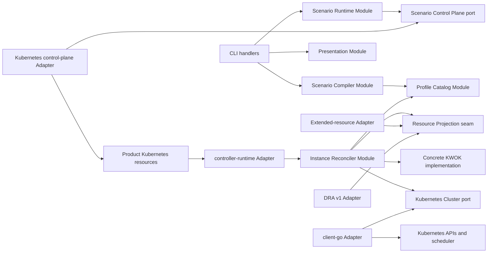

# ADR 0007: Organize the product around deep lifecycle Modules

Status: Accepted

## Context

The product has three deployed processes and several distinct kinds of change:

- a local CLI compiles files and shortcuts, performs explicit-target
  preflight, submits revisions, waits, and renders receipts;
- an in-cluster controller reconciles Scenario Instances through partial
  failure, restart, update, and ownership-safe deletion;
- an in-cluster read-only telemetry runtime turns exact owned inventory into
  immutable, explicitly simulated Prometheus samples;
- Vendor Profiles and Accelerator Models change as evidence-backed data;
- scalar extended resources and stable DRA require different Kubernetes
  projections;
- KWOK supplies the only maintained Synthetic Node lifecycle implementation;
- Kubernetes is an external system whose APIs, scheduler, admission, and
  authorization must be exercised rather than hidden by fake clients;
- human, JSON, and YAML output have different presentation needs but one
  versioned result contract.

Putting those concerns behind a generic `Backend`, one Adapter per vendor, or
one package per command would spread Scenario semantics, ownership checks, and
Kubernetes version branches across shallow Modules. Introducing a public
planner, a Synthetic Node runtime registry, or a test-harness provider before
a second real implementation exists would add hypothetical seams without
Leverage.

Three independent designs were compared:

1. A capability-oriented `Plan`/`Converge`/`Inspect` Interface maximized
   flexibility, but exposed an internal plan and optional degradation policy
   that conflict with the accepted fail-closed Fidelity Modes.
2. A Scenario Instance lifecycle with `Apply`/`Observe`/`Delete` concentrated
   target, revision, asynchronous convergence, recovery, and cleanup semantics
   behind three entry points.
3. A CLI-oriented apply/status/delete workflow made the common caller short,
   but became shallow when file bytes, shortcut flags, and output formats were
   allowed to enter the lifecycle Interface.

The second design has the best Depth. The third design remains useful as thin
command glue around it.

## Decision

### Implementation and distribution baseline

The product is one Go module and initially pins Go 1.26.x. Go matches the
Kubernetes client and controller ecosystem, produces static cross-platform CLI
binaries, and allows the domain and application Modules to be shared by the
CLI, controller, and tests without a network-specific schema becoming the
domain model.

The initial Kubernetes dependency line is:

- `k8s.io/*` and `client-go` v0.36.x, upgraded only with the ADR 0006 matrix;
- `controller-runtime` v0.24.x for controller process wiring, caches, queues,
  leader election, health endpoints, and Kubernetes scheme integration.

`controller-runtime` types do not enter the domain, compiler, catalog,
projection, receipt, or public lifecycle Interfaces. It is an implementation
choice at the controller delivery edge.

The repository builds three product binaries:

- `kasim`, the local product CLI;
- `kasim-controller`, the in-cluster reconciliation process.
- `kasim-telemetry`, the in-cluster read-only Prometheus process.

The End-to-End Test Harness is test code, not another product binary. The
release publishes a multi-architecture Linux runtime OCI image containing both
in-cluster binaries and a
`kasim-runtime` Helm chart. The chart installs the product CRDs, controller,
telemetry runtime, service accounts, explicit RBAC personas, hard real-Node
placement rules, and the pinned minimal KWOK runtime into an existing cluster.
It never creates, upgrades, or deletes the cluster itself.

The chart vendors or renders exact pinned KWOK assets rather than following a
floating Helm dependency. Installation refuses an incompatible pre-existing
product or KWOK ownership root. `kasim apply` never invokes Helm or performs
installation.

### Dependency direction

The implementation follows this one-way dependency graph:



Arrows point from callers and Adapters toward the Interfaces they use. Domain
values sit below the Modules in the diagram and import no CLI, YAML, Helm,
controller-runtime, client-go, KWOK, kind, or vendor-specific package.
Generated Kubernetes transport types are translated at the Adapter edge and
are not reused as domain types.

### Scenario Compiler Module

The Scenario Compiler is an in-process Module. Its concrete Interface is
deliberately not a Go interface type:

```go
func Compile(
    input ScenarioInput,
    catalog CatalogSnapshot,
) (CanonicalScenario, CompileReceipt, error)

func Revise(
    current CanonicalScenario,
    change TypedRevisionChange,
    catalog CatalogSnapshot,
) (CanonicalScenario, CompileReceipt, error)
```

`ScenarioInput` is a sealed sum of one document or one homogeneous shortcut.
It is not an extension registry. The compiler hides decoding, duplicate-key
rejection, strict schema handling, defaults, profile and model resolution,
quantity normalization, identity validation, conflict detection,
canonicalization, and digest calculation.

`health` and `scale` create typed revision changes and call `Revise`. They do
not mutate a backend directly. Client dry-run stops after this Module and
therefore needs no Kubernetes Adapter.

The compiler is pure and deterministic for a fixed input and catalog digest.
Its complexity is `O(node groups + pools + catalog references)`. Tests use its
Interface directly; parser, defaulting, validator, and digester helpers do not
receive separate mockable Interfaces or duplicate public tests.

### Profile Catalog Module

The Profile Catalog is another in-process Module with one implementation. It
loads the bundled immutable catalog and optional user-supplied custom records
through the same validation path. Its Interface supports:

- list and show for offline CLI inspection;
- resolve by profile ID, immutable revision, digest, model, Resource Contract,
  resource, and variant;
- return a bounded evidence and capability receipt;
- produce a stable catalog snapshot digest for compilation and release
  receipts.

Vendor Profiles are records, not Adapters. Adding NVIDIA, AMD, Huawei, Hygon,
MetaX, or any other ecosystem adds source-backed data and golden fixtures; it
does not add a vendor package, command, reconciler, or switch in the core.

There is no `ProfileSource` port in the first release. Bundled and custom
profiles are in-process inputs, not independent remote systems. A network
catalog becomes a true external seam only if a maintained remote source and a
second real caller are accepted later.

### Scenario Runtime Module

The Scenario Runtime remains the sole lifecycle Module presented to CLI
handlers and application-level tests:

```go
type ScenarioRuntime interface {
    Apply(context.Context, ApplyRequest) (Snapshot, error)
    Observe(context.Context, InstanceKey) (Snapshot, error)
    Delete(context.Context, InstanceRef) (Snapshot, error)
}
```

`ApplyRequest` contains an explicit immutable Simulation Target, a canonical
Scenario and compile receipt, the requested dry-run mode, UID and generation
preconditions, wait policy, and timeout. `InstanceKey` and `InstanceRef`
preserve target identity; delete requires the full reference.

The Interface includes the invariants and error semantics already accepted in
ADRs 0003 and 0005:

- preflight rejection has zero persistent writes;
- target fingerprint, UID, generation, ownership, profile digest, and Fidelity
  Mode fail closed;
- the same digest is a no-op;
- an accepted revision is distinguishable from convergence;
- timeout returns a receipt and latest bounded Snapshot and does not claim
  rollback;
- delete closes scheduling and never deletes or evicts an unowned Pod;
- machine diagnostics and exit categories remain stable.

The Module hides target loading, discovery, authentication, exact
SelfSubjectAccessReviews, dry-run, transport conversion, revision submission,
watch resumption, reconnect and retry policy, bounded observation, and receipt
assembly. CLI command handlers do not call client-go, decode CRDs, poll raw
objects, or interpret controller conditions.

### Scenario Control Plane seam

The in-cluster product controller is a remote-but-owned dependency of the
local Scenario Runtime. A private Scenario Control Plane port sits at that
seam:

```go
type scenarioControlPlane interface {
    Probe(context.Context, ExplicitTarget) (TargetCapabilities, error)
    Read(context.Context, InstanceKey) (InstanceRecord, error)
    Submit(context.Context, RevisionCommand) (SubmissionReceipt, error)
    Watch(context.Context, WatchCursor) (InstanceEventStream, error)
}
```

The production Adapter uses the explicitly selected kubeconfig and context to
communicate through the product's Kubernetes resources and their status. An
in-memory Adapter drives application tests. This is a real seam: production
transport and deterministic test behavior both vary while the workflow logic
stays in the Scenario Runtime.

`RevisionCommand` is intention-level and versioned. It is not an arbitrary
Kubernetes object or patch. The production Adapter atomically applies the
server-side UID, generation, resourceVersion, target, and ownership
preconditions defined by the product transport. The durable representation of
the current instance and immutable logical revisions remains hidden behind
this port.

### Instance Reconciler Module

Inside `kasim-controller`, controller-runtime is a delivery Adapter that turns
queue events into one concrete deep Module call:

```go
func (r *InstanceReconciler) Reconcile(
    context.Context,
    InstanceKey,
) (ReconcileResult, error)
```

Deletion is desired state and finalization inside the same method. There is no
separate create, update, health, scale, repair, or cleanup reconciler Interface.

One call hides:

1. durable instance and revision loading;
2. catalog receipt verification;
3. target capability and runtime checks;
4. backend-neutral desired graph compilation;
5. resource projection support and conflict checks;
6. exact owned-state observation;
7. ownership-aware diff and stale-inventory detection;
8. scheduling-close, create, status, open, replacement, and deletion ordering;
9. bounded API execution and retry classification;
10. achieved, excluded, unavailable, and out-of-scope fidelity assessment;
11. aggregate status, capped diagnostics, inventory, and observed-generation
    persistence.

The reconciler uses shared caches and bounded queues. It creates no permanent
goroutine, informer, or watch per Node, Accelerator, or Scenario Instance.
Reconciliation cost is proportional to the desired and exact owned object
sets; status and diagnostics remain bounded.

Tests call this Module through `Reconcile` with a deterministic Cluster port
Adapter. They assert observable records, changes, receipts, and conditions.
Helpers for graph compilation, ordering, batching, and recovery remain private
implementation and are not tested through parallel shallow Interfaces.

### Kubernetes Cluster seam

Kubernetes is a true external dependency of the reconciler. A private Cluster
port isolates external behavior:

```go
type clusterPort interface {
    Discover(context.Context) (TargetCapabilities, error)
    Observe(context.Context, OwnershipScope) (ObservedGraph, error)
    Execute(context.Context, OwnedChangeSet) (MutationReceipt, error)
}
```

The production client-go Adapter implements discovery, paginated reads,
server-side dry-run/apply, status subresources, UID/resourceVersion
preconditions, deletion propagation, API error classification, and audit
metadata. A deterministic recording Adapter is used for Module tests. Real
kind clusters exercise the production Adapter, admission, authorization,
scheduler, KWOK, and recovery behavior.

`OwnedChangeSet` contains only allowlisted internal operations with exact
ownership and preconditions. It is not a generic client-go wrapper. The
production Adapter repeats critical ownership validation immediately before a
mutation, while the reconciler remains the single owner of ordering and domain
policy.

Client-go fake clients are not accepted as evidence for scheduler, admission,
authorization, Server-Side Apply, status-subresource, or cleanup behavior.

### Resource Projection seam

Resource expression is the one real internal behavior seam with two production
Adapters:

```go
type resourceProjection interface {
    Support(TargetCapabilities, DesiredGraph) SupportReport
    Render(
        DesiredGraph,
        TargetCapabilities,
    ) (ProjectionFragment, error)
    Assess(
        ObservedGraph,
        ProjectionFragment,
    ) FidelityReport
}
```

The maintained Adapters are:

- `ExtendedResourceProjection` for `scheduling`;
- `DRAProjection` for stable `resource.k8s.io/v1` on Kubernetes 1.34+.

Adapters render desired fragments and assertions; they do not write
Kubernetes. The reconciler merges fragments, detects identity collisions,
orders operations, executes changes, and assembles status.

This seam concentrates Kubernetes version and representation differences
without creating a second Scenario model. Adding a projection requires a
distinct Kubernetes-visible contract, support policy, conflict rules,
validation matrix, and Fidelity Mode decision. It is not a generic plugin
registry.

### Concrete KWOK implementation

KWOK remains a concrete package-private implementation that contributes
Synthetic Node lifecycle metadata, annotations, status expectations, and
capability checks to the reconciler. No `SyntheticRuntime`, `NodeBackend`, or
backend registry exists in the first release.

The project-pinned KWOK assets, selectors, Stages, recovery behavior, and RBAC
stay local to this implementation. They never enter Scenario documents,
Vendor Profiles, lifecycle requests, receipts, or projection Interfaces.

A `SyntheticRuntime` seam is extracted only if a second maintained
implementation passes the same mixed-cluster safety, Pod lifecycle, recovery,
compatibility, and 1,000-Node gates and the project commits to shipping both.
Tests or a discarded native prototype do not qualify as a second Adapter.

kind is similarly concrete test infrastructure. It does not implement the
Scenario Runtime, Cluster port, Resource Projection, or a product backend
Interface. A harness-provider seam requires a second maintained cluster
provider with measured value.

### Presentation Module

Command handlers create one versioned `OutputEnvelope` from compiler,
preflight, lifecycle, or profile results and pass it to:

```go
func Render(OutputEnvelope, OutputFormat) ([]byte, error)
```

`OutputFormat` is a sealed `human`, `json`, or `yaml` value. The Presentation
Module owns stable machine schemas, diagnostic codes, secret redaction,
terminal layout, and capped detail formatting. It never reads Kubernetes or
reinterprets domain state.

Output formats are maintained variants, not a public formatter plugin seam.
Command handlers choose a format and write returned bytes; they do not branch
on Snapshot conditions or duplicate error wording.

### Initial source layout

The intended package and artifact layout is:

```text
api/simulation/v1alpha1/       generated Kubernetes transport types
cmd/kasim/                     CLI delivery
cmd/kasim-controller/          controller-runtime delivery
cmd/kasim-telemetry/           read-only telemetry process composition
internal/domain/               Scenario, identity, receipt and Snapshot values
internal/scenario/             Scenario Compiler Module
internal/catalog/              Profile Catalog Module
internal/application/          Scenario Runtime Module
internal/controlplane/         port and Kubernetes/in-memory Adapters
internal/reconcile/            Instance Reconciler Module
internal/projection/extended/  extended-resource Adapter
internal/projection/dra/       stable DRA v1 Adapter
internal/cluster/              port, client-go and recording Adapters
internal/runtime/kwok/         concrete pinned KWOK implementation
internal/presentation/         human and machine rendering
profiles/                      source-backed bundled catalog records
internal/telemetry/            Simulated Vendor Telemetry Module and Kubernetes Adapter
telemetryprofiles/             source-backed bundled Telemetry Contracts
charts/kasim-runtime/          existing-cluster runtime installation
test/e2e/                      kind, protocol and compatibility harnesses
```

Package names may be shortened when implementation proves a smaller cohesive
shape, but dependencies continue to point inward. There is no `utils`,
`common`, `backend`, `providers`, or vendor-per-package dumping ground.

### Extension discipline

The first release recognizes only these true seams:

| Seam | Why it is real | Production Adapters | Test strategy |
| --- | --- | --- | --- |
| Scenario Control Plane | owned remote controller transport varies from deterministic application tests | Kubernetes product-resource Adapter | in-memory |
| Kubernetes Cluster | true external system behavior must be isolated and classified | client-go | recording/in-memory |
| Resource Projection | two maintained Kubernetes representations have different support and assessment semantics | extended-resource, DRA v1 | contract fixtures for both |
| Telemetry Snapshot Source | read-only Kubernetes ownership and inventory are true external state | controller-runtime client | deterministic memory observations |

The following are sealed variants or concrete implementations, not seams:

- document, standard input, and shortcut Scenario inputs;
- human, JSON, and YAML output;
- bundled, provisional, and custom Vendor Profile records;
- KWOK Synthetic Node lifecycle;
- kind End-to-End Test Harness;
- product installation through Helm;
- typed health and scale revisions.

The following hypothetical seams are rejected:

- generic backend or vendor Adapter registries;
- public `Plan`, raw object renderer, or arbitrary Kubernetes manifest input;
- per-command workflow Modules;
- network Profile sources;
- native/KWOK runtime selection;
- kind/k3d cluster-provider selection;
- general workflow or timed-event engines.

A future seam must present two maintained Adapters, move real change behind one
stable Interface, and demonstrate higher Leverage and Locality than a direct
implementation. “Useful for mocking” or “might be extensible later” is not
sufficient.

### Testing at Module Interfaces

Tests replace internal layers rather than duplicating them:

- Scenario Compiler tests cover complete compile and typed revision outcomes,
  not parser/default/validator helper internals;
- Profile Catalog tests cover resolved records, evidence receipts, and
  digests;
- Scenario Runtime tests use the in-memory Scenario Control Plane Adapter and
  assert lifecycle and receipt behavior;
- Instance Reconciler tests use the recording Cluster Adapter and assert
  observable owned changes and status;
- Projection contract suites run identically against both production
  projection Adapters;
- Presentation golden tests cover the versioned envelope in all three formats;
- kind tests exercise the production Adapters and Kubernetes behavior;
- compatibility, protocol, scale, RBAC, and safety evidence follows ADR 0006.

Tests do not reach through a Module Interface to assert private graph nodes,
helper call counts, client-go request construction, or KWOK implementation
layout unless that fact is part of the selected Adapter's contract.

### Release contract

Product releases use Semantic Versioning and freeze these independently
versioned surfaces:

- CLI behavior and flags;
- Scenario and product Kubernetes transport schemas;
- machine output schema;
- bundled catalog revision and digest;
- compatibility matrix and dependency lock;
- Helm chart and controller image.
- Telemetry Catalog revision and digest.

The initial product Kubernetes transport and machine output schemas are
`v1alpha1`; their version does not weaken UID, generation, ownership, or
cleanup guarantees.

Release artifacts include:

- checksummed CLI archives for Linux and macOS on amd64 and arm64, and Windows
  on amd64;
- a Linux amd64/arm64 runtime OCI image containing controller and telemetry
  processes, pinned by digest;
- an OCI Helm chart and packaged `.tgz`;
- SBOMs, source revision, dependency lock, and build provenance.

The chart and image version match the product release, but embedded KWOK,
catalog, schema, and compatibility versions remain explicit rather than being
inferred from that tag. Homebrew, Scoop, shell installers, an exported Go SDK,
and a generic Operator SDK are outside the first release.

Every release must pass the gates in ADRs 0004 and 0006 before an artifact is
advertised as supported.

## Consequences

- The local lifecycle, controller reconciliation, and read-only telemetry
  responsibilities each receive a separate deep Module and process boundary.
- CLI, transport, Kubernetes, KWOK, DRA, catalog, and output changes remain
  local instead of spreading across command handlers or vendor branches.
- Only four seams exist initially, and each has two justified Adapters or a
  true external dependency with a deterministic test Adapter.
- The public lifecycle stays at three operations while internal reconciliation
  can evolve without widening it.
- Vendor coverage scales as data and evidence rather than source packages.
- KWOK can be replaced later without exposing it now, but replacement requires
  evidence strong enough to justify a real seam.
- Using one Go module and internal packages intentionally declines an unstable
  public Go SDK in favor of the CLI, Kubernetes transport, and machine-output
  contracts users actually consume.
- The Helm chart installs the runtime into an existing cluster without
  broadening the product CLI into a cluster lifecycle manager.

## Evidence

- [Deep module decision](https://github.com/LinkMaq/kube-accelerator-sim/issues/11)
- [Fidelity and backend architecture](0001-fidelity-modes-and-simulation-backends.md)
- [Vendor Profile and model contract](0002-vendor-profile-and-model-contract.md)
- [Revisioned Scenario Instance contract](0003-revisioned-scenario-instance-contract.md)
- [CLI and cluster safety contract](0005-explicit-target-receipt-driven-cli.md)
- [Kubernetes compatibility and validation policy](0006-kubernetes-compatibility-and-validation-policy.md)
- [Go release policy and Go 1.26](https://go.dev/doc/devel/release)
- [controller-runtime compatibility](https://github.com/kubernetes-sigs/controller-runtime#compatibility)
- [Helm OCI distribution](https://helm.sh/docs/topics/registries/)
